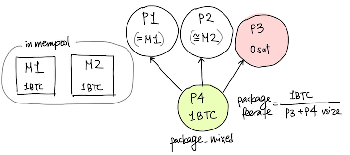

## Notes

* [Package Mempool Accept](https://gist.github.com/glozow/dc4e9d5c5b14ade7cdfac40f43adb18a) is a
  project to add policies for accepting packages of transactions (i.e. ones that would not otherwise
  be accepted individually) into the mempool, in preparation for package relay. We have covered other
  Package Mempool Accept PRs in previous review club meetings: [PR #20833](/20833),
  [PR #21800](/21800), and [PR #22674](/22674).

* [PR #24152](https://github.com/bitcoin/bitcoin/pull/24152) is the next PR in the series. It is
  centered around creating an incentive-compatible policy for assessing package feerates. It
  introduces three new concepts:

    - *Transactions are validated individually first* at the start of package validation. Any
      transactions that pass individually are removed from the package. Afterwards, only the
      leftover transactions are submitted through `AcceptMultipleTransactions()`.

    - *Package feerate* is defined as the total modified fees divided by the total virtual size of
      all transactions in the package after de-duplication and individual submission of each
      transaction. For a "package" of 1 transaction, this is equivalent to its modified feerate.

    - Package feerate, instead of individual feerate, is used to evaluate the transactions in the
      two feerate policies: the static Minimum Relay Feerate (`minRelayTxFee`) and dynamic mempool
      minimum feerate.

* Incentive compatibility is the main concern of this PR. The following capabilities and
  restrictions encapsulate the behavior we are aiming for for users:

	1. A child can pay for both itself and its parent within a package. This is also known as
	   Child Pays For Parent (CPFP).

	2. A child *must* pay for both itself and its parent within the package. The
	   package feerate must meet the minimum requirements.

	3. Ensure we use modified feerate  rather than base feerate. Modified fees
	   include base fees and any fee delta from `prioritisetransaction`, which can
	   be used by miners to give priority to their own transactions in their mempools.


	4. A transaction should not help the feerate of another transaction if it is not an ancestor
	   (i.e.  not necessary for the other transaction to be mined).  Discourage "parent pays for
	   child" and "sibling pays for sibling" behavior.

	5. A transaction should not *harm* the feerate of another transaction if it is not an ancestor
	   (i.e. not necessary for the other transaction to be mined). A low-fee child in the package
	   should not stop its parent(s) from being accepted if they have sufficient feerates individually.

	6. A transaction's fees should never be "double counted." Once a transaction has been submitted to
	   the mempool, don't include its fee or size in feerate calculations again.

* Tests are added to represent various desirable and undesirable fee-related policies. The
  packages tested are illustrated in the diagrams below:

	
	
	
	

## Questions

1. Did you review the PR? [Concept ACK, approach ACK, tested ACK, or
   NACK](https://github.com/bitcoin/bitcoin/blob/master/CONTRIBUTING.md#peer-review)? What was your
   review approach?

2. Define package feerate, in your own words.

3. Quiz: Let's say we have transactions {A, B, C, D} where {A, B, C} are parents of D.
   For simplification, transactions are 100vB. All {A, B, C} pay 0 fees, and D pays 30,000sat in fees.
   The user makes this series of calls:

   ```
   sendrawtransaction(A)
   prioritisetransaction(B, +100,000sat)
   sendrawtransaction(B)
   prioritisetransaction(C, +10,000sat)
   ```
   Now we submit package {A, B, C, D} and it succeeds. What is the package feerate returned?

     (A) 100sat/vB

     (B) 150sat/vB

     (C) 200sat/vB

     (D) 300sat/vB

     (E) 350sat/vB

     (F) no package feerate

4. Why is submitting individually first and using this definition of package feerate sufficient to
   ensure we are assessing feerates properly? (Hint: [we restrict package
topology](o://github.com/bitcoin-core-review-club/bitcoin/blob/7daf3d08b48669305574bc306d42a243ff1a25fb/src/validation.cpp#L1290-L1326))

5. Would this definition of package feerate work for all types of packages? For example, packages
   with three generations, a parent with multiple children, unrelated transactions, etc.

6. Do you agree with the 6 incentive-related behaviors described in the notes above? Can you think
   of anything missing?

7. Do the tests cover all 6 points? (It may help to go through each point and see which test covers
   each). Do you have any suggestions for more tests cases?

8. If `AcceptSingleTransaction()` fails
   [here](https://github.com/bitcoin-core-review-club/bitcoin/blob/pr24152/src/validation.cpp#L1369-L1370)
   due to a consensus rule, is there any reason we should do package validation later? Is there any
   reason we should continue to validate the other transactions in the package?

9. Why do we need to create a new set of `ATMPArgs`
   [here](https://github.com/bitcoin-core-review-club/bitcoin/blob/7daf3d08b48669305574bc306d42a243ff1a25fb/src/validation.cpp#L1341)?
   Why can't we just use `args` for individual submission?  Why *must* we pass in `args` when
   creating `single_args`? Why don't we just create a new ATMPArgs from scratch?

<!-- TODO: After meeting, uncomment and add meeting log between the irc tags
## Meeting Log



-->
